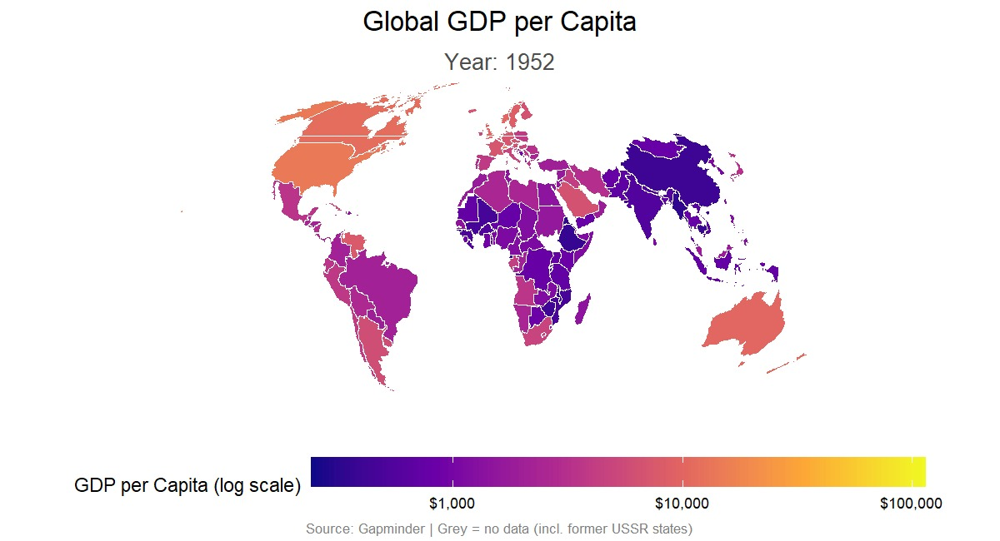

# Global GDP per Capita — Animated Choropleth Map

Animated world map showing GDP per capita from 1952–2007, built entirely in R.


## Features

- **Equal Earth projection** — accurate area representation
- **Box-Cox transformation** — optimal scaling for skewed GDP data
- **Animated timeline** — smooth transitions across years with progress bar
- **Globe outline** — ocean background with graticule grid
- **Country boundaries** — visible border lines between nations

## Requirements

```r
install.packages(c("here", "ggplot2", "gganimate", "sf", "maps",
                    "dplyr", "gifski", "gapminder", "scales", "MASS"))
```

## Usage

```r
source("gdp_map.R")
```

The script outputs `gdp_map_v9.gif` in your working directory.

## Data Source

- [Gapminder](https://www.gapminder.org/) — GDP per capita (1952–2007)

## Static Preview


